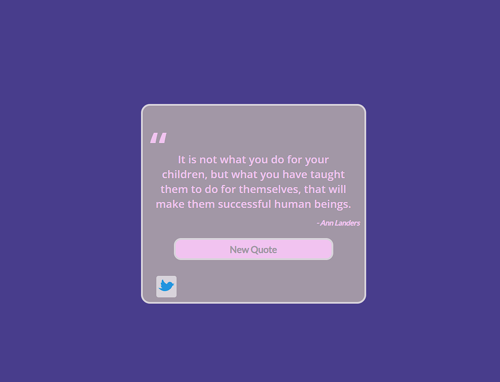
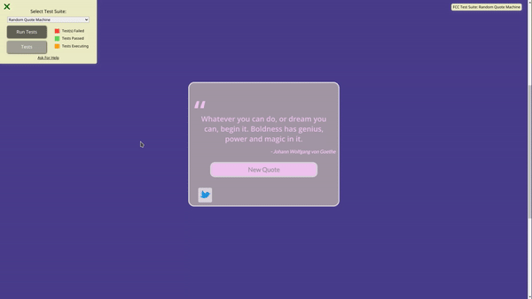

# Random Quote Machine

 [](https://app.netlify.com/sites/neon-pudding-48aa0e/deploys)

## Description

View random quotes from notable people. Created using React.

## Table of Contents

* [Description](#Description)
* [Installation](#Installation)
* [Usage](#Usage)
* [License](#License)
* [Contributing](#Contributing)
* [Tests](#Tests)
* [Questions](#Questions)

## Installation

Download and install npm packages with the following command:


```
npm i
```
    

## Usage

Deployed page is accessibile at: https://quotemachine.aywin.uk/


```
npm start
```
    



## License

This work is licensed under the following license: MIT

---


Copyright 2023 AywinK

Permission is hereby granted, free of charge, to any person obtaining a copy of this software and associated documentation files (the "Software"), to deal in the Software without restriction, including without limitation the rights to use, copy, modify, merge, publish, distribute, sublicense, and/or sell copies of the Software, and to permit persons to whom the Software is furnished to do so, subject to the following conditions:
            
The above copyright notice and this permission notice shall be included in all copies or substantial portions of the Software.
            
THE SOFTWARE IS PROVIDED "AS IS", WITHOUT WARRANTY OF ANY KIND, EXPRESS OR IMPLIED, INCLUDING BUT NOT LIMITED TO THE WARRANTIES OF MERCHANTABILITY, FITNESS FOR A PARTICULAR PURPOSE AND NONINFRINGEMENT. IN NO EVENT SHALL THE AUTHORS OR COPYRIGHT HOLDERS BE LIABLE FOR ANY CLAIM, DAMAGES OR OTHER LIABILITY, WHETHER IN AN ACTION OF CONTRACT, TORT OR OTHERWISE, ARISING FROM, OUT OF OR IN CONNECTION WITH THE SOFTWARE OR THE USE OR OTHER DEALINGS IN THE SOFTWARE.
    


## Contributing

This is my solution to the first project for the freeCodeCamp Front-End Development Libraries Certification. Feel free to fork the project to view how I hae completed the project. If you would like to share any cool features that could be implemented, feel free to send a pull request.

## Tests

freeCodeCamp test suite can be ran on the project by selecting "Random Quote Machine" option from the dropdown menu either locally or on the live deployed page.




## Questions

Discover more projects or get in touch - [AywinK](https://github.com/AywinK "My GitHub Profile")

Contact <AywinK@hotmail.co.uk> with any additional questions or comments.
